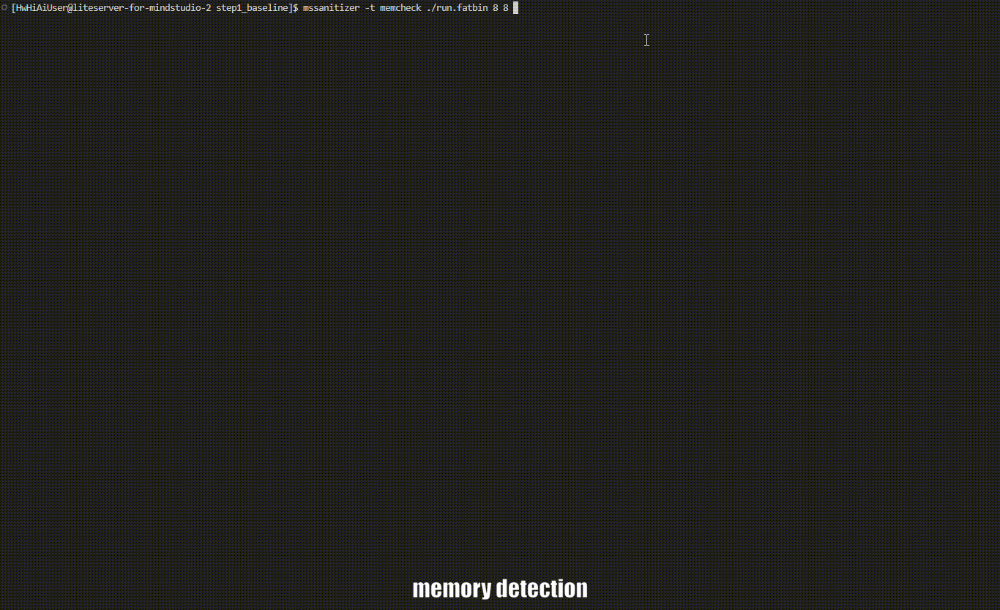

<h1 align="center">MindStudio Sanitizer</h1>

<b>Ascend AI Operator Exception Check Tool</b>

 
 
 
 
 
 

## ✨ Latest Updates

🔹 **[Dec 31, 2025]**: MindStudio Sanitizer is fully open-sourced.

## ️ ℹ️ Overview

MindStudio Sanitizer (msSanitizer) is a single-operator exception check tool designed for Ascend AI Processors and can check the following issues: memory overwriting, data race, uninitialized access, and synchronization exceptions.

  <h4>▶️ Quick Demo</h4>
  
  
Figure: Operator memory, uninitialized access, and race check process demonstration

## ⚙️ Functions

msSanitizer provides different exception check capabilities through multiple sub-modules. The following functions are supported:

| Function| Description |
|---------|--------|
| **Memory check**| Checks memory exceptions such as out-of-bounds access and unaligned access in the global memory and local memory.|
| **Race check**| Checks data race issues caused by concurrent memory access in a parallel computing environment.|
| **Uninitialization check** | Checks memory read exceptions caused by the use of uninitialized variables.|
| **Synchronization check**  |Checks for unpaired `SetFlag`/`WaitFlag` instructions in Ascend C operators.|

## 🚀 Quick Start

For details about how to quickly experience core functions through a simple addition operator example, see [msSanitizer Quick Start](./docs/en/quick_start/mssanitizer_quick_start.md).

## 📦 Installation Guide

For details about the environment dependencies and installation methods of the tool, see the [msSanitizer Installation Guide](docs/en/install_guide/mssanitizer_install_guide.md).

## 📘 User Guide

For details about how to use the tool, see the [msSanitizer User Guide](docs/en/user_guide/mssanitizer_user_guide.md).

## 💡 Typical Cases

For details about how to understand and use the tool through typical cases, see [msSanitizer Typical Cases](docs/en/best_practices/mssanitizer_basic_cases.md).

## 📚 API Reference

For details about the APIs, including sanitizer APIs and msTX APIs, see [msSanitizer API Reference](docs/en/api_reference/mssanitizer_api_reference.md).

## 💬 FAQs

For details about common issues and solutions, see [msSanitizer FAQs](docs/en/support/mssanitizer_faq.md).

## 🌌 Smart Search

To improve documentation search efficiency, we provide multiple efficient search methods:

- **[Precise Search (ReadTheDocs)](https://mindstudio-operator-tools-docs.readthedocs.io/en/latest/)**: Performs millisecond-level structured search across all documents to precisely locate underlying configuration and API details.
- **[AI Q&A (DeepWiki)](https://deepwiki.com/mindstudio-docs/master)**: A context-based AI development assistant that answers natural language questions within seconds.

## 🛠️ Contribution Guide

You are welcome to contribute to the project. For details, see the [Contribution Guide](./docs/en/contributing/contributing_guide.md).

## ⚖️ Related Information

🔹 [Release Notes](https://gitcode.com/Ascend/mssanitizer/releases)
🔹 [License Notice](./docs/en/legal/license_notice.md)
🔹 [Security Statement](./docs/en/legal/security_statement.md)
🔹 [Disclaimer](./docs/en/legal/disclaimer.md)

## 🤝 Suggestions and Communication

You are welcome to contribute to the community. If you have any questions or suggestions, please submit an [issue](https://gitcode.com/Ascend/mssanitizer/issues). We will reply as soon as possible. Thank you for your support.

| Instant Interaction (WeChat Group) | Official Updates (WeChat Account) | In-depth Support (Assistant/Forum) |
|:--:|:--:|:--:|
|  *Scan to join the technical discussion group* |  *Scan to follow the official WeChat account* | Scan to join the group and follow the account to access the fastest communication platform for MindStudio users and developers:   **Ask questions:** Discuss technical issues with community peers in real time **Stay informed:** Get version release and feature update notifications as soon as they are released  **Share experience:** Exchange best practices and hands-on insights with developers      **More support channels**: 👉 Ascend Assistant:  👉 Ascend Forum:  |

## 🙏 Acknowledgements

This tool is jointly developed by the following Huawei departments:   
🔹 Ascend Computing MindStudio Development Department
🔹 Ascend Computing Ecosystem Enablement Department
🔹 Huawei Cloud AI Compute Service
🔹 Compiler Technologies Lab, 2012 Labs
🔹 Markov Lab, 2012 Labs
Thank you to everyone in the community for your PRs. We warmly welcome your contributions.
